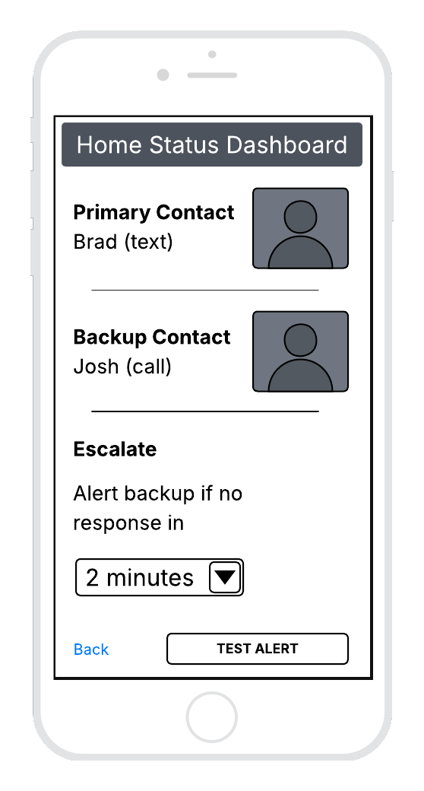
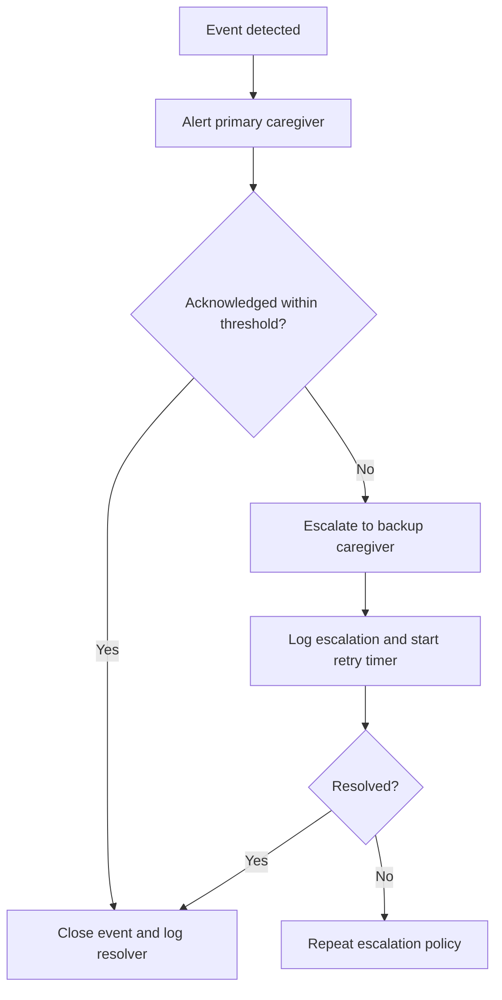
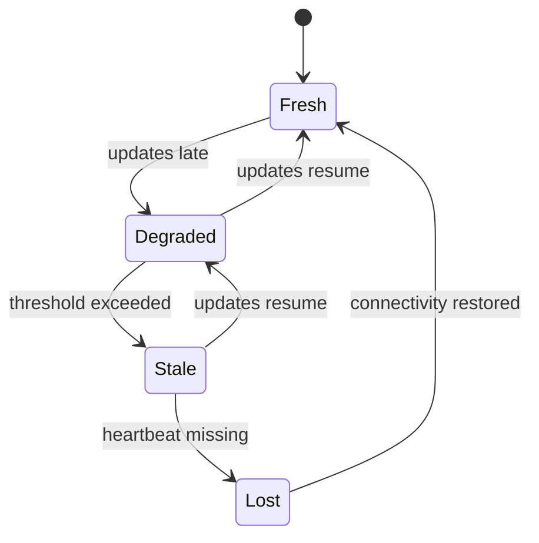
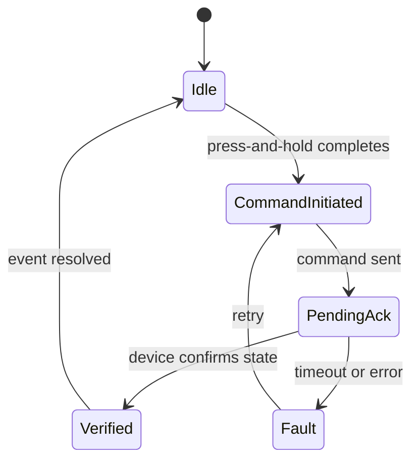

# CS-319 UI-UX Evidence Locker - SafeHaven (Project One)

<p align="center">
  
</p>

<p align="center">
  
  
  <a href="LICENSE"></a>
  
  
</p>

<!--
After pushing to GitHub, replace the two setup badges above with workflow badges:

[](https://github.com/<OWNER>/<REPO>/actions/workflows/quality.yml)
[](https://github.com/<OWNER>/<REPO>/actions/workflows/links.yml)
-->

<p align="center">
  <a href="#mission-abstract">Mission Abstract</a> |
  <a href="#triage-rapid-assessment">Triage</a> |
  <a href="#artifact-inventory">Artifact Inventory</a> |
  <a href="#operational-model-safety-critical-ux">Operational Model</a> |
  <a href="#system-models">System Models</a> |
  <a href="#verification-protocol">Verification</a> |
  <a href="#key-competencies-demonstrated">Competencies</a> |
  <a href="#appendix-repository-map">Appendix</a> |
  <a href="#personnel">Personnel</a> |
  <a href="#academic-integrity">Academic Integrity</a>
</p>

---

## Mission Abstract

SafeHaven is a caregiver safety concept for dementia support. The UI prioritizes situational awareness and speed to action for two time-critical hazards: wandering outside a safe boundary and a stove left on long enough to create fire risk.

This repository is a documentation-first evidence locker for SNHU CS-319. It preserves an auditable trail from user needs to wireframes, rationale, requirements, risk assessment, and platform adaptation.

---

## Triage (Rapid Assessment)

> Reviewer start point - complete this checklist in order for fastest audit.

| Order | File | Why it matters |
| --- | --- | --- |
| 1 | TRACEABILITY_MATRIX.md | Fast audit map from competencies and requirements to evidence |
| 2 | evidence/03_ops_design/project_one_safehaven/wireframes.md | Wireframe intent and file index |
| 3 | evidence/03_ops_design/project_one_safehaven/design_rationale_from_submission.md | Submitted design rationale (Project One) |
| 4 | evidence/03_ops_design/project_one_safehaven/critique.md | Safety-critical critique and fix list |
| 5 | evidence/02_mission_reqs/requirements.md | Testable UI requirements |
| 6 | evidence/02_mission_reqs/risk_register.md | Hazards, mitigations, residual risk |
| 7 | evidence/03_ops_design/project_one_safehaven/platform_adaptation.md | Watch and kiosk doctrine |

---

## Artifact Inventory

| Category | Artifact | Purpose | Status |
| --- | --- | --- | --- |
| Briefing | README.md | Executive briefing and review order | Complete |
| Traceability | TRACEABILITY_MATRIX.md | Map competencies, rubric, requirements to evidence | Complete |
| Submission record | SUBMISSIONS.md | Submitted vs portfolio enhancements separation | Complete |
| Wireframes | assets/img/wireframes/ | Digital wireframes for Project One | Complete |
| Rationale | submissions/CS319_Project_One_Submission.pdf | Submitted narrative rationale | Complete |
| Requirements | evidence/02_mission_reqs/requirements.md | Testable UI requirements | Complete |
| Definitions | evidence/02_mission_reqs/definitions.md | Central models and terminology | Complete |
| Risk register | evidence/02_mission_reqs/risk_register.md | Risk assessment and mitigations | Complete |
| Critique | evidence/03_ops_design/project_one_safehaven/critique.md | Screen-by-screen safety critique | Complete |
| Platform adaptation | evidence/03_ops_design/project_one_safehaven/platform_adaptation.md | Watch and kiosk recommendations | Complete |
| Project Two scaffold | evidence/03_ops_design/project_two_kiva/README.md | Planned work, not started | Planned |
| Optional mock | src/prototypes/ | Closed-loop interaction demonstration | Optional |

---

## Wireframes

<table>
  <tr>
    <td align="center">
      <strong>Care Circle Setup</strong><br/>
      
    </td>
    <td align="center">
      <strong>Home Status Dashboard</strong><br/>
      
    </td>
  </tr>
  <tr>
    <td align="center">
      <strong>Stove Risk Alert</strong><br/>
      
    </td>
    <td align="center">
      <strong>Wandering Alert</strong><br/>
      
    </td>
  </tr>
</table>

---

## Operational Model (Safety-Critical UX)

1. Context - Caregivers operate under fatigue, stress, and time pressure.
2. Priority - Situational awareness, error prevention, speed to action.
3. Core doctrine - Three-state status, closed-loop confirmation, data freshness discipline, double coding. See evidence/02_mission_reqs/definitions.md.
4. Failure philosophy - Ambiguity is the most dangerous state. See evidence/02_mission_reqs/risk_register.md.
5. Scope discipline - This repo remains within CS-319 deliverables and portfolio packaging. See SUBMISSIONS.md.

---

## System Models

### Model 1 - Escalation Flow (Role-Based Failover)



### Model 2 - Data Freshness Degradation Model



### Model 3 - Closed-Loop Confirmation States



---

## Verification Protocol

Quality is enforced through GitHub Actions.

| Control | Workflow | Purpose |
| --- | --- | --- |
| Markdown linting | .github/workflows/quality.yml | Structure, headers, and markdown hygiene |
| Spell checking | .github/workflows/quality.yml | Reduce errors and maintain vocabulary discipline |
| Link integrity | .github/workflows/links.yml | Prevent link rot in portfolio documentation |

Local execution is optional. CI is the source of truth.

---

## Key Competencies Demonstrated

| Competency | Evidence |
| --- | --- |
| Analyze UI-UX fundamentals | evidence/02_mission_reqs/definitions.md |
| Mobile and touch-based UI-UX | evidence/03_ops_design/project_one_safehaven/wireframes.md |
| Embedded and cloud UI-UX planning | evidence/03_ops_design/project_two_kiva/README.md |

---

## Appendix Repository Map

```text
cs319-safehaven-mission-assurance/
  .github/
    ISSUE_TEMPLATE/
    workflows/
  assets/
    img/
      cover.png
      wireframes/
  design_system/
  evidence/
    01_intel_research/
    02_mission_reqs/
    03_ops_design/
      project_one_safehaven/
      project_two_kiva/
    04_after_action/
  src/
    prototypes/
  submissions/
  README.md
  TRACEABILITY_MATRIX.md
  SUBMISSIONS.md
  REFERENCES.md
```

---

## Personnel

| Field | Value |
| --- | --- |
| Name | Bradley Saucier |
| Service | USAF (Ret.) |
| Role | Deputy Operations Manager, defense tech |
| Program | B.S. Candidate, Computer Science (STEM Project Management), SNHU |

---

## Academic Integrity

This repository contains coursework artifacts produced for SNHU CS-319 and repackaged for portfolio review. All work is my own.

If any portion is reused, cite the repository and distinguish original content from derived material.

Badge note - If you publish under a different GitHub user or repository name, update the badge URLs at the top of this README.
