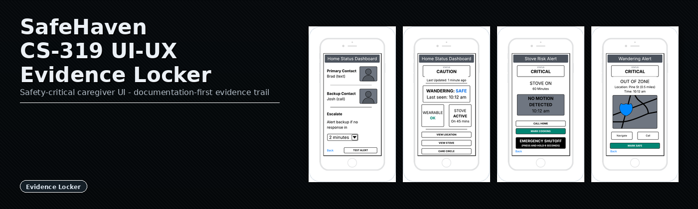
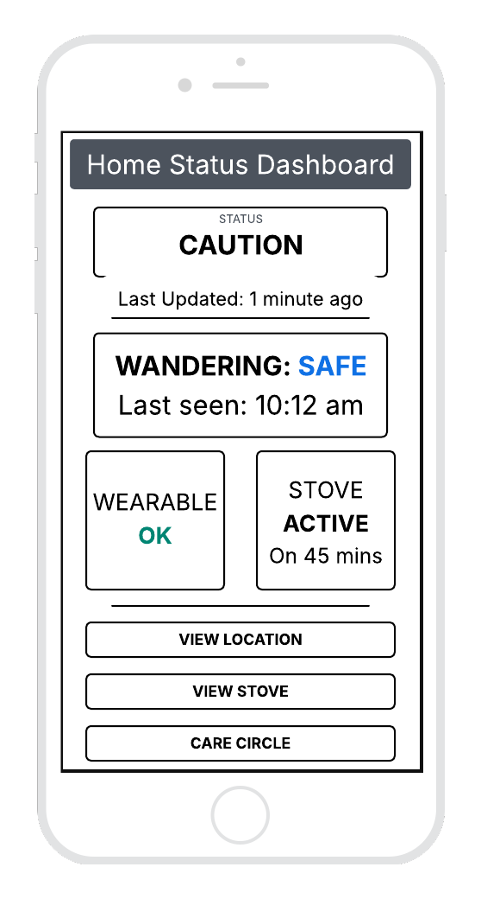
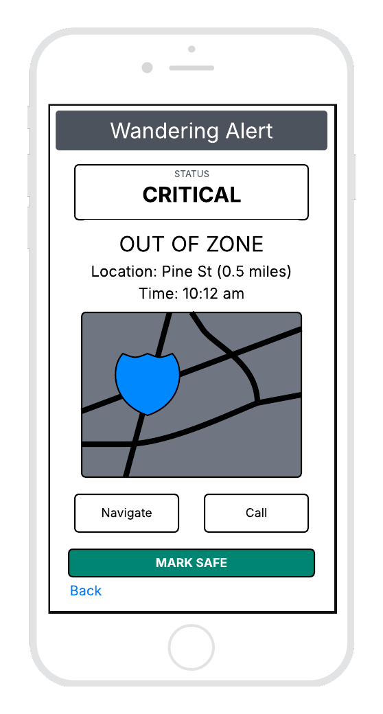
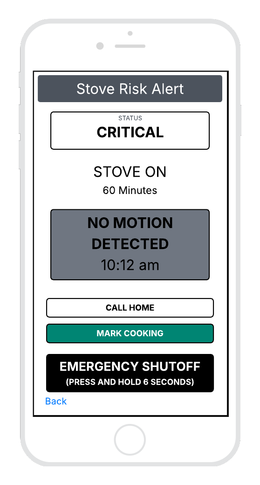
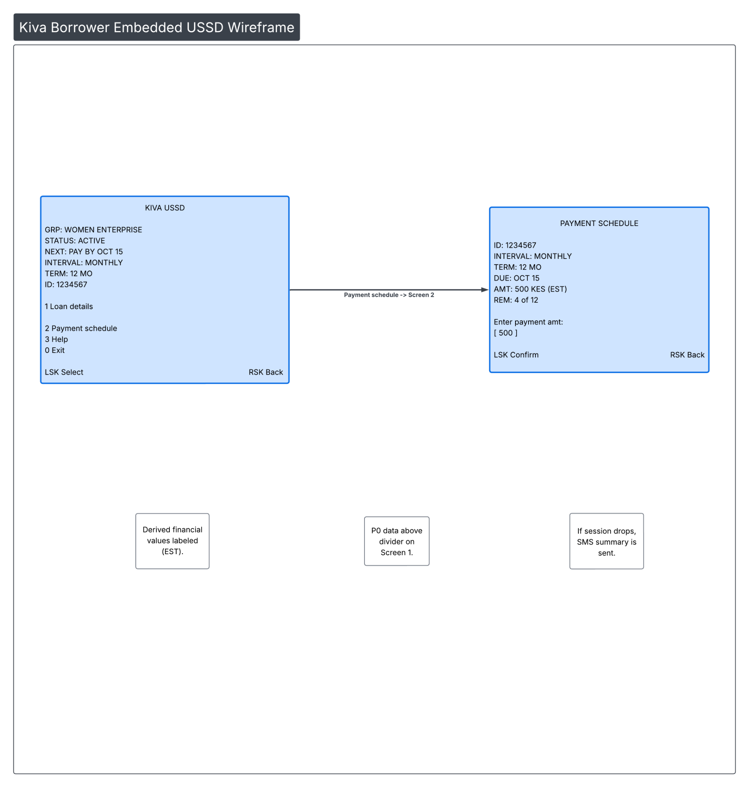

# CS-319 UI-UX Evidence Locker

SafeHaven (Project One) - Kiva (Project Two)

<p align="left">
  
</p>

<p align="left">
  <a href="https://github.com/bradsaucier/cct-ui-evidence-locker/actions/workflows/quality.yml">
    
  </a>
  <a href="https://github.com/bradsaucier/cct-ui-evidence-locker/actions/workflows/links.yml">
    
  </a>
  
  
  
</p>

> [!IMPORTANT]
> **BOTTOM LINE UP FRONT**
> This repository is a documentation-first UI-UX evidence locker built for portfolio review.<br><br>
> Operational framing:<br>
> Operation SafeHaven - safety-critical caregiver interface designed for high stress and time compression.<br>
> Operation Kiva - austere USSD borrower flow (Edge) paired with a cloud lender dashboard (Core) under cost and latency discipline.<br><br>
> Engineering posture:<br>
> Explicit constraints and failure modes.<br>
> Estimates marked "EST" when data is incomplete.<br>
> Requirement-to-evidence traceability is treated as a first-class deliverable.

> [!TIP]
> **EVALUATOR FAST PATH**
> <table>
> <tr><th align="left">Target</th><th align="left">Link</th><th align="left">Notes</th></tr>
> <tr><td>Project One submission (PDF)</td><td><a href="submissions/CS319_Project_One_Submission.pdf">CS319_Project_One_Submission.pdf</a></td><td>SafeHaven deliverable package</td></tr>
> <tr><td>Project Two submission (PDF)</td><td><a href="submissions/CS319_Project_Two_Report.pdf">CS319_Project_Two_Report.pdf</a></td><td>Kiva deliverable package</td></tr>
> <tr><td>Traceability matrix</td><td><a href="TRACEABILITY_MATRIX.md">TRACEABILITY_MATRIX.md</a></td><td>Requirements mapped to evidence</td></tr>
> <tr><td>Submission index</td><td><a href="SUBMISSIONS.md">SUBMISSIONS.md</a></td><td>Quick access to graded artifacts</td></tr>
> <tr><td>Local prototype (HTML)</td><td><a href="src/prototypes/safehaven-ui-mock.html">safehaven-ui-mock.html</a></td><td>Open locally in a browser</td></tr>
> <tr><td>Prototype notes</td><td><a href="src/prototypes/README.md">src/prototypes/README.md</a></td><td>Scenarios and interaction notes</td></tr>
> </table>

<details>
<summary><strong>Operational dossier</strong> (expand)</summary>

```yaml
STATUS  : ACTIVE
AUTHOR  : Bradley Saucier, SMSgt, USAF (Ret.)
COURSE  : SNHU CS-319 - UI/UX Design and Development
FOCUS   : mission-grade interface design, constraint-first documentation, requirements traceability
DOCTRINE: operator bandwidth, cognitive load control, explicit risk controls, accessibility-aligned design
LICENSE : MIT
```

</details>

## Table of contents

1. [Operational overview](#operational-overview)
2. [Visual intel](#visual-intel)
3. [Operation SafeHaven (Project One)](#operation-safehaven-project-one)
4. [Operation Kiva (Project Two)](#operation-kiva-project-two)
5. [Prototype deployment](#prototype-deployment)
6. [Verification and QA](#verification-and-qa)
7. [Evidence index](#evidence-index)
8. [Program controls](#program-controls)
9. [Academic integrity](#academic-integrity)
10. [Personnel](#personnel)
11. [License](#license)

---

## Operational overview

| Directive | Specification |
| --- | --- |
| Purpose | Preserve course artifacts as an auditable portfolio package for defense-tech review. |
| Deliverables | Wireframes, requirements, risk register, traceability matrix, PDFs, local prototype. |
| Verification | Markdown lint, spell check, link integrity (Lychee) via GitHub Actions. |
| Reader model | Recruiter scan in seconds, technical lead deep dive on demand. |

<details>
<summary><strong>Why this repo exists</strong> (expand)</summary>

This course did not require a repository. I built one anyway.

Intent:

- Preserve evidence in a reviewable structure.
- Translate UI-UX intent into verifiable artifacts.
- Demonstrate documentation discipline expected in high-reliability environments.

</details>

<details>
<summary><strong>Standards and constraints</strong> (expand)</summary>

| Category | Implementation |
| --- | --- |
| Evidence format | Markdown evidence packages, PDF submissions, PNG wireframes |
| Prototype | HTML, CSS, vanilla JavaScript (local only) |
| Design doctrine | WCAG 2.2 informed design, platform guidance, constraint-first decisions |
| Security posture | Public portfolio - no backend, no user data, no credentials |

</details>

---

## Visual intel

<table>
<tr>
<td width="50%" valign="top">

<p><strong>SafeHaven - Home Status Dashboard</strong><br>three-state model reduces decision time.</p>



</td>
<td width="50%" valign="top">

<p><strong>SafeHaven - Wandering Alert</strong><br>high salience, immediate action paths.</p>



</td>
</tr>
<tr>
<td width="50%" valign="top">

<p><strong>SafeHaven - Stove Risk Alert</strong><br>hazard identification plus rapid response.</p>



</td>
<td width="50%" valign="top">

<p><strong>Kiva - Borrower USSD Flow</strong><br>flat menu, numeric input, shared-device privacy.</p>



</td>
</tr>
</table>

---

## Operation SafeHaven (Project One)

### Situation - SafeHaven

Operating environment: Residential setting. Operator experiences cognitive load and time pressure during escalations.

Objective: Reduce errors during escalation and preserve privacy during alerts.

### Doctrine - SafeHaven

| Hazard | Control | Evidence |
| --- | --- | --- |
| Wandering beyond a safe boundary | Three-state status model to reduce decision time. | [wireframes.md](evidence/03_ops_design/project_one_safehaven/wireframes.md) |
| Unattended thermal source (stove-oven) | High salience alert plus immediate response action. | [design_rationale_from_submission.md](evidence/03_ops_design/project_one_safehaven/design_rationale_from_submission.md) |
| Lock-screen privacy during alerts | Non-descriptive notifications and escalation handling. | [notification_privacy_policy.md](evidence/02_mission_reqs/notification_privacy_policy.md) |

### Execution - SafeHaven

| Phase | Artifact |
| --- | --- |
| Intel | [user_needs_summary.md](evidence/01_intel_research/user_needs_summary.md) |
| Requirements | [requirements.md](evidence/02_mission_reqs/requirements.md) |
| Wireframes | [wireframes.md](evidence/03_ops_design/project_one_safehaven/wireframes.md) |
| Critique | [critique.md](evidence/03_ops_design/project_one_safehaven/critique.md) |
| Prototype | [safehaven-ui-mock.html](src/prototypes/safehaven-ui-mock.html) |
| Submission | [CS319_Project_One_Submission.pdf](submissions/CS319_Project_One_Submission.pdf) |

### Evidence package - SafeHaven

- [Project One evidence folder](evidence/03_ops_design/project_one_safehaven/)
- [Project One submission PDF](submissions/CS319_Project_One_Submission.pdf)

---

## Operation Kiva (Project Two)

### Situation - Kiva

Operating environment: Emerging markets. Many borrowers use USSD on shared devices. Lenders view data in the cloud.

Objective: Support borrower repayment planning without transaction history. Provide lender dashboards under cost and latency discipline.

### Doctrine - Kiva

| Constraint | Control | Evidence |
| --- | --- | --- |
| USSD timeouts and limited input | Flat menu, numeric inputs, short strings. | [kiva_wireframes.md](evidence/03_ops_design/project_two_kiva/kiva_wireframes.md) |
| Shared-device privacy risk | Minimal identifiers, 0-exit, non-sensitive labels. | [kiva_wireframes.md](evidence/03_ops_design/project_two_kiva/kiva_wireframes.md) |
| Cloud cost discipline | Aggregations and precomputed metrics. | [kiva_cloud_architecture.md](evidence/03_ops_design/project_two_kiva/kiva_cloud_architecture.md) |

### Execution - Kiva

| Phase | Artifact |
| --- | --- |
| Intel | [kiva_user_needs_summary.md](evidence/01_intel_research/kiva_user_needs_summary.md) |
| Requirements | [requirements_kiva.md](evidence/02_mission_reqs/requirements_kiva.md) |
| Wireframes | [kiva_wireframes.md](evidence/03_ops_design/project_two_kiva/kiva_wireframes.md) |
| Cloud architecture | [kiva_cloud_architecture.md](evidence/03_ops_design/project_two_kiva/kiva_cloud_architecture.md) |
| Submission | [CS319_Project_Two_Report.pdf](submissions/CS319_Project_Two_Report.pdf) |

### Evidence package - Kiva

- [Project Two evidence folder](evidence/03_ops_design/project_two_kiva/)
- [Project Two submission PDF](submissions/CS319_Project_Two_Report.pdf)

---

## Prototype deployment

Local-only prototype for SafeHaven.

1. Open [safehaven-ui-mock.html](src/prototypes/safehaven-ui-mock.html) in a browser.
2. Use [src/prototypes/README.md](src/prototypes/README.md) for scenario notes.

---

## Verification and QA

> [!TIP]
> **HOW TO VERIFY**<br>
> CI badges at the top of this README reflect current automated checks.<br>
> Traceability matrix: [TRACEABILITY_MATRIX.md](TRACEABILITY_MATRIX.md).<br>
> Submission index: [SUBMISSIONS.md](SUBMISSIONS.md).<br>
> Risk register: [risk_register.md](evidence/02_mission_reqs/risk_register.md).

> [!WARNING]
> **SCOPE BOUNDARY**<br>
> This repository is UI-UX evidence. It intentionally does not implement a backend. Verification focuses on documentation integrity, traceability, and prototype behavior.

---

## Evidence index

<details>
<summary><strong>Full evidence index</strong> (expand for complete directory map)</summary>

### Evidence structure

```text
evidence/
  01_intel_research/               User needs and problem framing
    user_needs_summary.md          SafeHaven user needs
    kiva_user_needs_summary.md     Kiva user needs
  02_mission_reqs/                 Requirements, definitions, risk controls
    requirements.md                SafeHaven requirements
    requirements_kiva.md           Kiva requirements
    definitions.md                 Term definitions
    risk_register.md               Risk register
    notification_privacy_policy.md Notification privacy handling
  03_ops_design/
    project_one_safehaven/
      wireframes.md                Wireframe index
      critique.md                  Critique of design
      platform_adaptation.md       Adaptation notes
      design_rationale_from_submission.md Design rationale
    project_two_kiva/
      kiva_wireframes.md           Kiva wireframe index
      kiva_cloud_architecture.md   Cloud architecture notes
  04_after_action/
    after_action_review.md         After action review
```

### Wireframe assets

```text
assets/img/wireframes/
  care_circle_setup.png
  home_status_dashboard.png
  stove_risk_alert.png
  wandering_alert.png
  kiva/kiva_borrower_ussd_wireframe.png
```

### Prototype files

```text
src/prototypes/
  safehaven-ui-mock.html           Local prototype
  styles.css                       Prototype styles
  app.js                           Prototype script
  README.md                        Prototype instructions
```

### Design system

```text
design_system/
  tokens.json                      Design token values
  tokens.md                        Token documentation
```

</details>

---

## Program controls

| Control | Link |
| --- | --- |
| Traceability matrix | [TRACEABILITY_MATRIX.md](TRACEABILITY_MATRIX.md) |
| Risk register | [risk_register.md](evidence/02_mission_reqs/risk_register.md) |
| Definitions | [definitions.md](evidence/02_mission_reqs/definitions.md) |
| Design tokens | [tokens.md](design_system/tokens.md) |
| Submission index | [SUBMISSIONS.md](SUBMISSIONS.md) |
| After action review | [after_action_review.md](evidence/04_after_action/after_action_review.md) |
| References | [REFERENCES.md](REFERENCES.md) |
| Security policy | [SECURITY.md](SECURITY.md) |
| Citation | [CITATION.cff](CITATION.cff) |
| Contributing | [CONTRIBUTING.md](CONTRIBUTING.md) |

---

## Academic integrity

This repository contains coursework artifacts produced for SNHU CS-319 and repackaged for portfolio review. All work is my own.

If any portion is reused, cite the repository and distinguish original content from derived material.

---

## Personnel

| Field | Value |
| --- | --- |
| Name | Bradley Saucier |
| Service | SMSgt, USAF (Ret.) |
| Program | B.S. Candidate, Computer Science (STEM Project Management), SNHU |
| Degree | B.A., Economics, Columbia University |
| Degree | A.A.S., Community College of the Air Force |

---

## License

MIT License. See [LICENSE](LICENSE).
