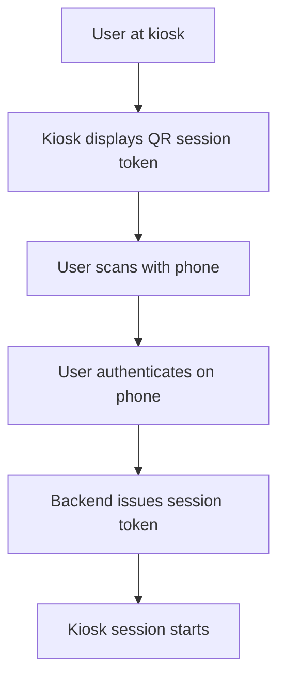

# Platform Adaptation

## 1. Wear OS (watch) doctrine

The watch is triage, not configuration.

Design intent

1. Answer threat and location in under 5 seconds
2. Use one-tap actions only (call, open on phone)
3. Use strong haptic feedback patterns for critical alerts
4. Keep updates to a conservative cadence to preserve battery life

Implementation note

A wandering event is an active state until resolved. Use an ongoing activity pattern so the alert remains present.

## 2. Kiosk (large screen) doctrine

The kiosk is a shared awareness display.

Design intent

1. Distance legibility for 10 to 15 feet viewing
2. Very large touch targets to account for gross motor input
3. Privacy masking for sensitive fields

### 2.1 Decoupled authentication pattern

This pattern avoids entering credentials on a public touchscreen.

Emergency actions should bypass authentication where safety is at stake.

## 3. Watch face format transition

As of early 2026, watch faces are shifting toward declarative formats (WFF). This portfolio notes the transition as a future constraint rather than implementing a watch face directly.
